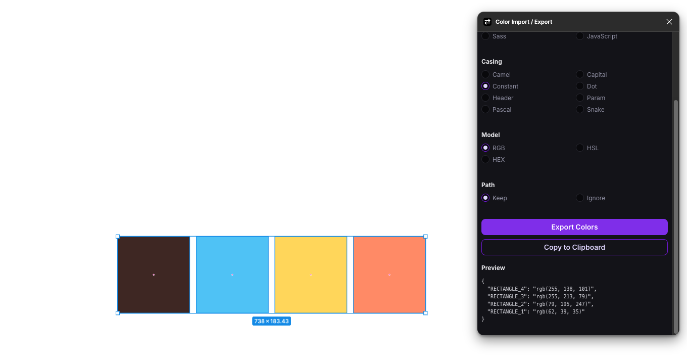
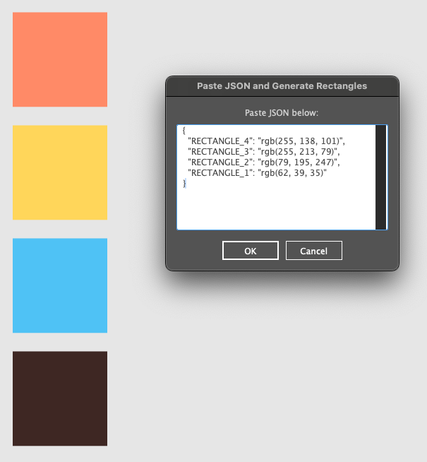
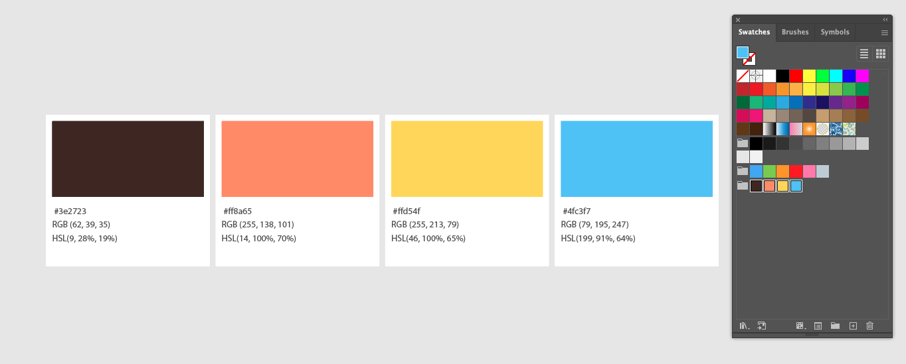

# Import Colors from Figma to Illustrator

This script enables you to seamlessly import color palettes from Figma into Illustrator, ensuring consistency across both tools.

### Example JSON Format:

```json
{
  "example_color_1": "rgb(0, 113, 114)",
  "example_color_2": "rgb(242, 147, 37)",
  "example_color_3": "rgb(217, 79, 4)"
}
```

To export colors from Figma, use the "Color Import/Export" plugin:

1. Select the styles you want to export.



2. Copy the JSON to your clipboard.
3. In Illustrator, run the script and paste the JSON when prompted.



---

# Create Color Guide from Selected Swatches

This script helps you create a visual color guide from selected swatches in Illustrator.

### Instructions:

1. Select the swatches from the Swatches panel <span style='color: orange;'>(⚠️ Warning: global colors cannot be used)</span>
2. Run the script.
3. The script generates groups of rectangles for each selected color, displaying their HEX, RGB, and HSL values.


